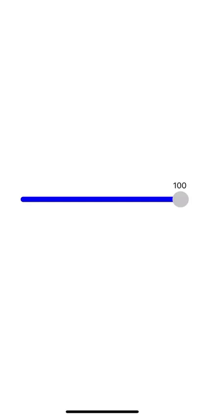

# React Native Custom Range Slider

`react-native-range-custom-slider` is a customizable and easy-to-use range slider component for React Native. It allows you to select a value from a specified range by dragging a thumb along a track.


<p align="center">

  

</p>


## Installation

To install the package, use npm or yarn:

```bash
npm install react-native-range-custom-slider

yarn add react-native-range-custom-slider
```

##Usage

```JSX

import React, { useState } from 'react';
import { View, Text } from 'react-native';
import CustomSlider from 'react-native-range-custom-slider';

const App = () => {
    const [sliderValue, setSliderValue] = useState(50);

    return (
        <View style={{ flex: 1, justifyContent: 'center', alignItems: 'center' }}>
            <Text>Slider Value: {sliderValue}</Text>
            <CustomSlider
                value={sliderValue}
                minimumValue={0}
                maximumValue={100}
                step={1}
                onValueChange={(value) => setSliderValue(value)}
                minimumTrackTintColor="blue"
                maximumTrackTintColor="grey"
                thumbStyle={{ backgroundColor: 'blue' }}
                trackStyle={{ height: 10 }}
                style={{ width: 300 }}
            />
        </View>
    );
};

export default App;

```
## API

| Prop                     | Type       | Default      | Description                                                           |
|--------------------------|------------|--------------|-----------------------------------------------------------------------|
| `value`                  | `number`   | `0`          | The current value of the slider.                                      |
| `minimumValue`           | `number`   | `1`          | The minimum value of the slider.                                      |
| `maximumValue`           | `number`   | `100`        | The maximum value of the slider.                                      |
| `step`                   | `number`   | `1`          | The step value of the slider.                                         |
| `onValueChange`          | `function` | `undefined`  | Callback function called when the slider value changes.               |
| `minimumTrackTintColor`  | `string`   | `undefined`  | The color of the track to the left of the slider thumb.               |
| `maximumTrackTintColor`  | `string`   | `undefined`  | The color of the track to the right of the slider thumb.              |
| `thumbStyle`             | `object`   | `{}`         | Style object for customizing the thumb.                               |
| `trackStyle`             | `object`   | `{}`         | Style object for customizing the track.                               |
| `style`                  | `object`   | `{}`         | Style object for customizing the container.                           |
| `disabled`               | `boolean`  | `false`      | If true, the slider is disabled and the thumb cannot be moved.        |
| `thumbProps`             | `object`   | `undefined`  | Props for customizing the thumb, including custom children elements.  |


Contributing

You are interested and want to contribute? Awesome, just consider the following steps:

1. Fork this repository.
2. Add and test the fixes/improvements you worked on to a seperate branch.
3. Submit your pull request(PR).

Author

This package is maintained by justcodi22.